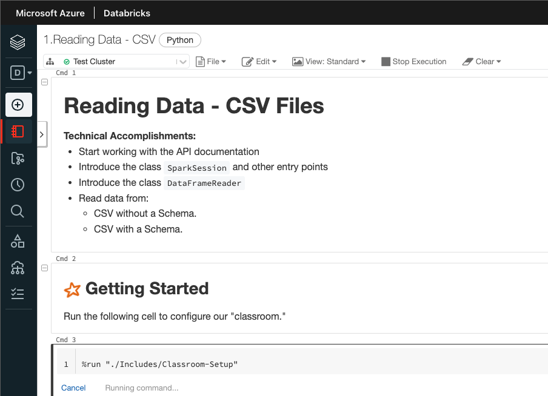
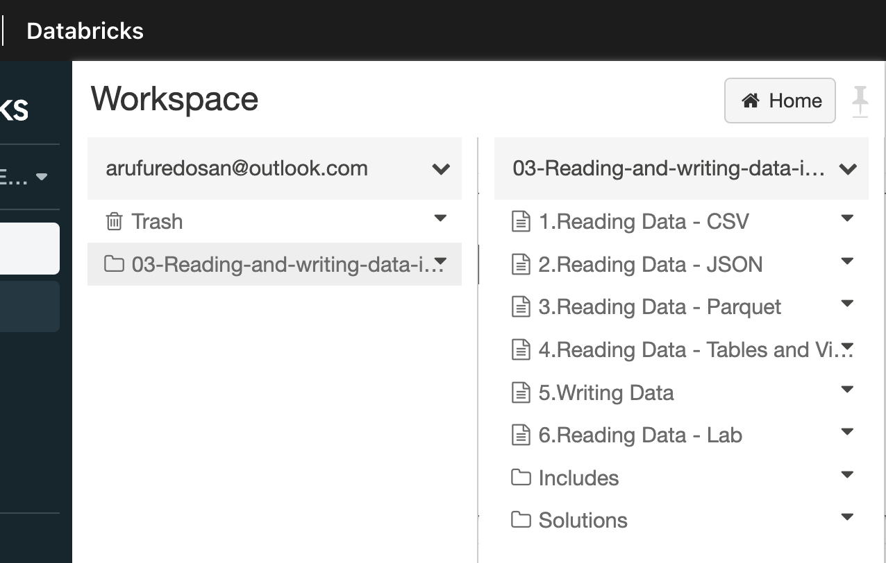
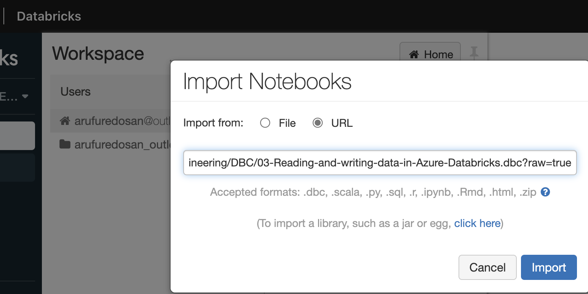

# Read and Write Data in Azure Databricks

Databricks is a platform to work with big data. Azure has a solid integration with Databricks, making it easy to setup and start working with datasets.

## Module Sources

[Read and write data in Azure Databricks](https://docs.microsoft.com/learn/modules/read-write-data-azure-databricks/?WT.mc_id=academic-56680-alfredodeza)

## Goals

In this workshop, you'll use Databricks, a powerful platform to work with big data. We'll go over reading and writing different data types in Azure Databricks like JSON, Parquet, and CSV. You'll also learn how to read and operate on stored data in Databricks.

| **Goal**              | Description                                    |
| ----------------------------- | --------------------------------------------------------------------- |
| **What will you learn**       | Read and write different types of data in Azure Databricks |
| **What you'll need**          | An Azure subscription: <ul><li>[Free Azure Trial](https://azure.microsoft.com/free/?WT.mc_id=academic-56680-alfredodeza)</li> <li>[Azure For Students](https://azure.microsoft.com/free/students/?WT.mc_id=academic-56680-alfredodeza)</li></ul>                                          |
| **Duration**                                      | 1 hour |
| **Slides**                                        | [Powerpoint](slides.pptx)                                                                                      |

## Video

> 🎥 Click the image above to learn how to deliver this workshop

## Pre-Learning

- [Describe Azure Databricks](https://docs.microsoft.com/learn/modules/describe-azure-databricks/?WT.mc_id=academic-56680-alfredodeza)

## Prerequisites

Attendees should have an Azure account. There are several options that can give you free credits:

- [Free Azure Trial](https://azure.microsoft.com/free/?WT.mc_id=academic-56680-alfredodeza)
- [Azure For Students](https://azure.microsoft.com/free/students/?WT.mc_id=academic-56680-alfredodeza)

For this workshop, students will go through the [Read and write data in Azure Databricks](https://docs.microsoft.com/learn/modules/read-write-data-azure-databricks/?WT.mc_id=academic-56680-alfredodeza) Learn Module which will direct you to import Jupyter Notebooks to execute processes using Databricks. These notebooks will show you how to read and write data in Azure Databricks.

## What students will learn

Databricks is one of the most prominent platforms to deal with big data and perform collaborative tasks in Data Science. In this workshop, you will cover how to get started with the platform in Azure and perform data interactions including reading, writing, and analyzing datasets.

Read data:

Work with notebooks:

Import notebooks:

Attach a cluster to a workplace:

## Milestone 1: Read data in CSV format

[Start here](https://docs.microsoft.com/learn/modules/describe-azure-databricks/5-exercise-work-notebooks?WT.mc_id=academic-56680-alfredodeza) to create an Azure Databricks cluster and go through the notebook to read data. This notebook will cover the following:

- Cover the `SparkSession` class
- Read a very simple TSV (tab-separated value) file
- Transform the TSV into a CSV (comma-separated value) file
- Read the CSV file with an inferred schema and then with a user-defined schema

## Milestone 2: Read data in JSON format

Continue with the next notebook to read JSON data after completing the CSV notebook. Go through the steps required to read and load the JSON data into Databricks. In this section you will:

- Load a JSON file into Databricks
- Use inferring to auto detect the types of values and data in the JSON file
- With `pyspark`, you'll create a user-defined schema to load JSON

## Milestone 3: Read data in Parquet format

Work through the next notebook (_3.Reading Data - Parquet_) to load Parquet files that usually come with a pre-defined schema. Similar to other milestones, in this section you will:

- Load a Parquet file with a pre-defined schema
- Understand why Parquet files usually come with a schema
- Read data from the Parquet file and visualize some of its details

## Milestone 4: Read data stored in tables and views

Go to the next notebook (_4.Reading Data - Tables and Views_) in the Databricks notebook to read data stored in tables and views. In this section you will see how to register tables and read from a table or view, these will include:

- Register a table into Databricks
- Use a TSV file to create a new table
- Visualize the loaded data in the UI
- Create a temporary view

## Milestone 5: Write data

Finally, go to the last notebook (_5.Writing Data_) where you will use Parquet files to write data. You'll cover loading a TSV file into Databricks and then save it as a Parquet file using the `Pyspark` Python API.

## Quiz

Verify your knowledge with [a short quiz](https://docs.microsoft.com/learn/modules/read-write-data-azure-databricks/8-knowledge-check?WT.mc_id=academic-56680-alfredodeza)

## Next steps

There is a slightly more advanced and involved learning path that covers [Data Engineering with Azure Databricks](https://docs.microsoft.com/learn/paths/data-engineer-azure-databricks/?WT.mc_id=academic-56680-alfredodeza).

## Practice

In this workshop you used small data sets that are easy to work with. Try using larger datasets to take advantage of a platform like Databricks.

## Feedback

Be sure to give [feedback about this workshop](https://forms.office.com/r/MdhJWMZthR)!

[Code of Conduct](../../CODE_OF_CONDUCT.md)
