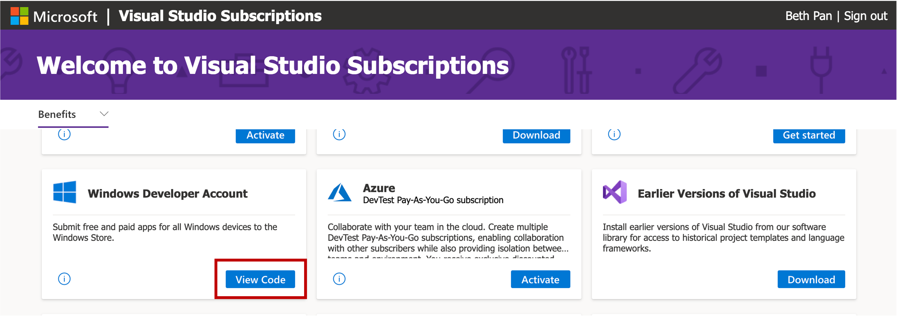
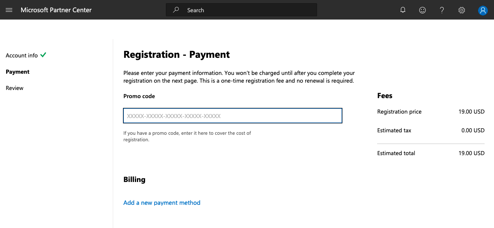

[⏮️ Go back to previous step](6-notifications.md)

# Audit and package your PWA to distribute to app stores

In this step, we will audit the PWA to make sure it is installable and ready for publishing. We will also package the PWA to make it ready for distribution to app stores.

## Audit with PWA Studio

You can do this directly in VSCode with the PWA Studio extension. Navigate to the extension pane and checkout each section - web manifest, service worker, and store ready checklist. It looks like this:

You can also perform the audit through other tools such as [PWABuilder](https://aka.ms/learn-pwa/workshop/30days-3.5?id=audit-with-pwabuilder) and [Lighthouse in Edge dev tools](https://aka.ms/learn-pwa/workshop/30days-3.5?id=audit-performance-with-lighthouse-and-devtools).

## Package your PWA

There are a couple of ways to package your PWAs. You can follow the steps below to package with PWA Studio extension:

1. First, associate your PWA with a URL. Hit `ctrl-shift-P` in VS Code. Search for `PWA Studio: Set App URL`. Select `Yes` and provide the URL of the Azure Static Web App you deployed in step 3.
1. Hit `ctrl-shift-P` in VS Code again. Search for `PWA Studio: Package your PWA`. Select the platform you would like to package your PWA for and follow the prompts. Congratulations, your PWA package will be generated!

You can also package your PWA via [pwabuilder.com](https://aka.ms/learn-pwa/workshop/pwabuilder.com) site. Here are the [steps of packaging from PWABuilder docs](https://aka.ms/learn-pwa/workshop/docs.pwabuilder.com/builder/windows?id=packaging).

## Submit your app to the Microsoft Store

Let's use Microsoft Store as an example and see how you can submit your app!

### Register with Windows Dev Center

1. Head over to [Windows Dev Center](https://aka.ms/learn-pwa/workshop/developer.microsoft.com/windows) and click Register. You will be taken to the [store registration page](https://aka.ms/learn-pwa/workshop/developer.microsoft.com/microsoft-store/register). Click the SIGN UP button.

2. You will now be redirected to a login page. Login with your Microsoft account (@hotmail, @outlook, etc.). If you don't have a Microsoft account, you can create one from [here](https://aka.ms/learn-pwa/workshop/outlook.live.com/owa).
3. Once you are logged in, you should be redirected to Microsoft Partner Center site on Registration - Account Info page. Follow the setup steps to create your account. Select 'Individual' as account type if you plan to submit apps as yourself.

4. After you finish your input on basic information, you will land on the Registration - Payment page. If you are registered as a student ambassador, you should have access to Visual Studio Enterprise subscription. This provides a promo code so you can save $19 in the registration process. To do this, head over to [Visual Studio subscriptions page](https://aka.ms/learn-pwa/workshop/my.visualstudio.com/Benefits) and log in with the account with the Visual Studio Enterprise subscription benefit. Browse the page to find Windows Developer Account benefit and click View Code button. Copy the code in the format of XXXXX-XXXXX-XXXXX-XXXXX-XXXXX.

5. Input the promo code copied from last step or pay with your preferred method on the Registration - Payment page of Microsoft Partner Center site.

6. Now review your account information, accept the terms and conditions of the App Developer Agreement, and click Finish button on the Registration - Review page.

### Reserve your app

1. After you registered with Partner Center, head over to your [dashboard](https://aka.ms/learn-pwa/workshop/partner.microsoft.com/dashboard/home).
1. Navigate to `Apps and Games`. Depends on your visit history of the page, either click `Create a new app` button or click `+ New Product` button and select `App`.
1. Provide the name of your app. **Make sure this name is the same you listed in your manifest. When it comes time to upload your app bundles, it will check if the bundle matches the name of the registered app.**
1. Once the name is reserved, you will be able to access your package information via `Product Identity` tab. Record `Package ID`, `Publisher ID`, and `Publisher Display Name` as these will be required either you are packaging through PWA Studio or PWABuilder site.

### Submit to the Store

1. Head back to your [dashboard](https://aka.ms/learn-pwa/workshop/partner.microsoft.com/dashboard/home) in Partner Center and select the listing you created from the list.
1. Click `Start your submission` and select the `Packages` section. Drag and drop the packages generated. Click `Save`.
1. Fill in the rest of your app submission sections to finish submitting to the store. Note that it will take up to 48 hours for the review process to complete.

## Summary and next steps

Congratulations! You have finished this workshop from generating a PWA to submitting it to the Microsoft Store. You can continue to grow your PWA skills by exploring the resources such as [30 Days of PWA](https://aka.ms/learn-pwa/30days-blog) or [Microsoft Edge docs on PWA](https://aka.ms/learn-pwa/workshop/docs.microsoft.com/microsoft-edge/progressive-web-apps-chromium).

## Resources
- [30 Days of PWA: 3.5 Auditing tools](https://aka.ms/learn-pwa/workshop/30days-3.5)
- [30 Days of PWA: 3.6 Test automation tools](https://aka.ms/learn-pwa/workshop/30days-3.6)
- [30 Days of PWA: 3.7 Packaging tools](https://aka.ms/learn-pwa/workshop/30days-3.7)
- [30 Days of PWA: 4.3 Best practices for distributing your PWA](https://aka.ms/learn-pwa/workshop/30days-4.3)
- [Microsoft Edge docs: Publish a Progressive Web App to the Microsoft Store](https://aka.ms/learn-pwa/workshop/docs.microsoft.com/microsoft-edge/progressive-web-apps-chromium/how-to/microsoft-store)